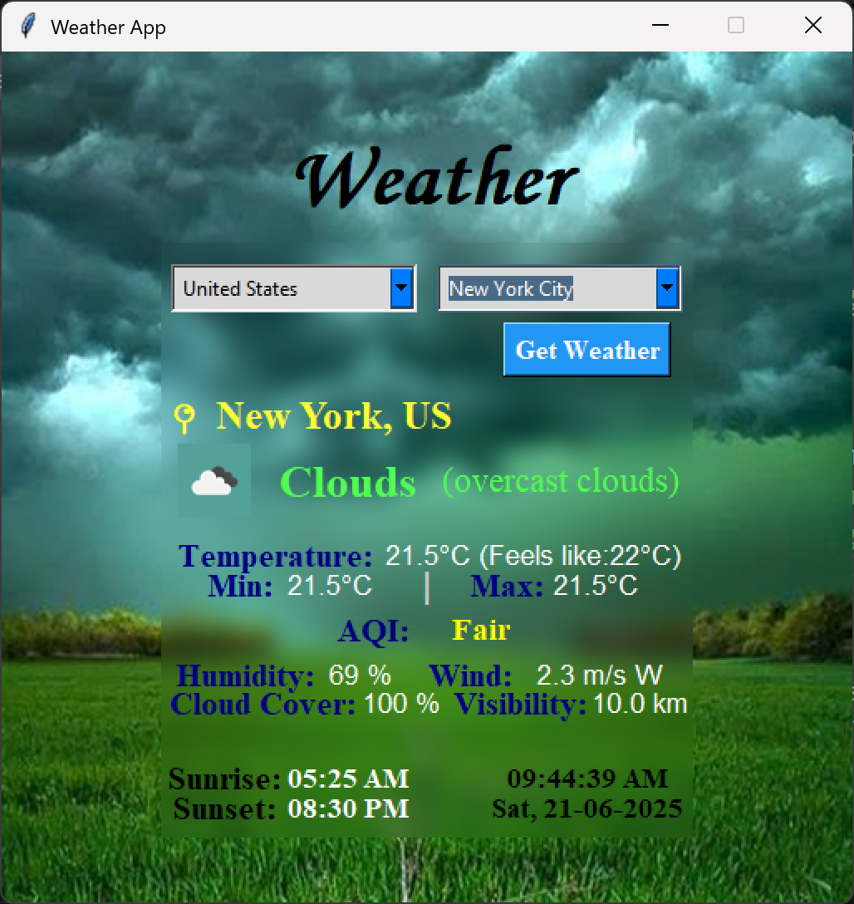
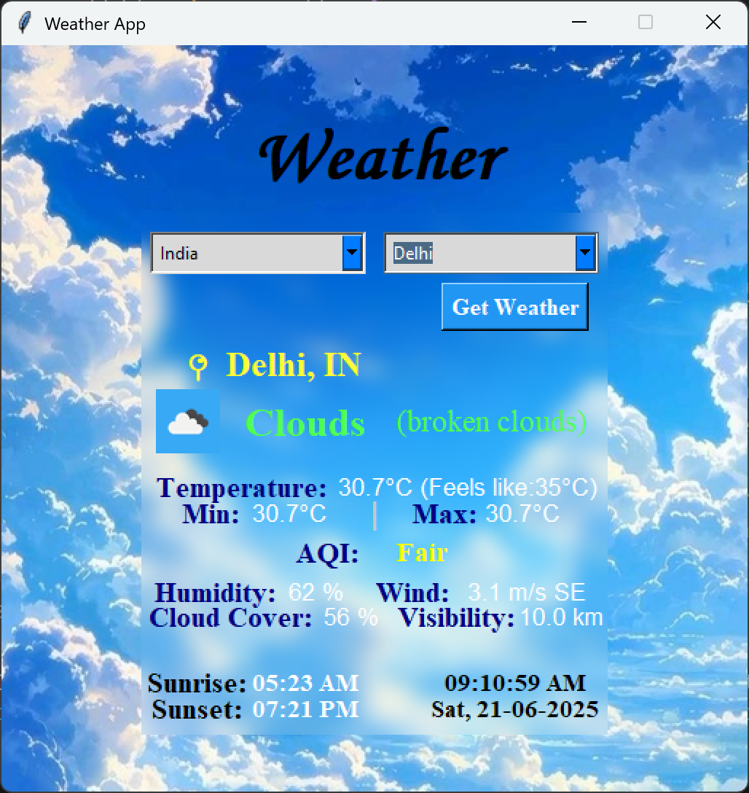
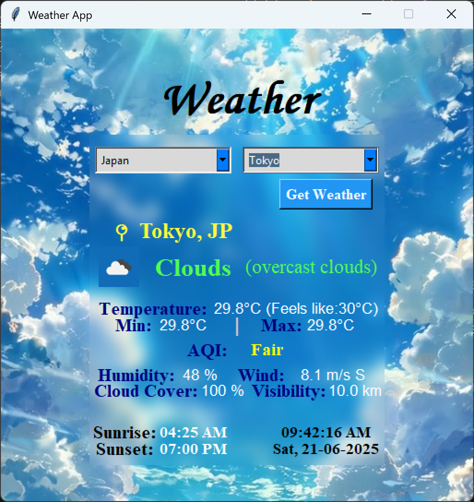

# 🌦️ Weather App (GUI)

## 📌 Project Overview

This **Weather App** is a desktop GUI application built with **Python (Tkinter)** as part of the **RISE (Real‑time Internship & Skill Enhancement)** program by **Tamizhan Skills**.\
It allows users to access **real-time weather data** by selecting a country and city — displayed through a sleek, glass-style interface featuring visuals, icons, and detailed weather statistics.

---

## 🏁 About RISE

**RISE** is a free, hands-on internship initiative that turns academic knowledge into practical experience through project-based learning across domains such as:

* 🤖 Artificial Intelligence
* 💻 Web Development
* 📊 Data Science
* 📱 App Development
* 🐍 Python Programming (my chosen domain)
* 🔌 IoT and more
* 🛠️ etc.

---

## 🔧 Project 5: Weather App (GUI)

### 📝 Problem Statement

Most users rely on search engines to check the weather, which can be a time-consuming process. A compact, user-friendly desktop app can simplify access to local weather conditions.

### 🎯 Objective

Develop a **Tkinter-based GUI application** that:

1. Accepts user input for **country and city** using dropdowns.
2. Fetches real-time weather using the **OpenWeatherMap API**.
3. Displays temperature, weather description, and humidity with a modern UI.

---

## 🚀 Features

* ✅ Country and city selection via dropdowns (auto-populated using geonamescache)
* ✅ Real-time weather data via **OpenWeatherMap API**
* ✅ Beautiful **Glass-style GUI** with dynamic blurred background
* ✅ Real-time **clock and date**
* ✅ Auto-updated **city list by selected country**
* ✅ **Weather icons** dynamically fetched from OpenWeatherMap
* ✅ Color-coded **Air Quality Index (AQI)**
* ✅ Timezone-aware **sunrise and sunset** conversion
* ✅ Easily switchable background theme (bg01.jpg / bg02.jpg / bg03.jpg)
* ✅ Displays: *Temperature* (with feels-like value), *weather condition* and description, *humidity*, *AQI* (Air Quality Index) with colored indicators, *wind speed* and direction, *cloud cover* and *visibility*, *sunrise and sunset times* (converted to local time), and date & time display.

---

## 🖼️ UI Customization

You can customize the app's background by changing the image file in the line where `img_bg` is defined.

Available options:

* `bg01.jpg` (Midnight Overcast)
* `bg02.jpg` (CloudSync)
* `bg03.jpg` (Skybound Serenity – Default)

> **Note:** When changing the background, update the weather icon label’s `bg` color to match:
>
> |        Theme          | Image File | Icon Label Color |
> | --------------------- | ---------- | ---------------- |
> |  Midnight Overcast    | bg01.jpg   | `#54A19A`        |
> |      CloudSync        | bg02.jpg   | `#38A9F4`        |
> |  Skybound Serenity    | bg03.jpg   | `#106CB7`        |

---

## 📂 Technologies Used

| Component         | Description                       |
| ----------------- | --------------------------------- |
| **Python 3.9+**   | Core language                     |
| **Tkinter**       | GUI toolkit                       |
| **Pillow (PIL)**  | Image processing and blur effects |
| **requests**      | API calls for weather & AQI       |
| **geonamescache** | Country → city mapping            |

---

## 🧑‍💻 How to Run

1. **Clone or download this repository** to your local machine.

2. **Install the required dependencies**:

   ```bash
   pip install pillow requests geonamescache
   ```

3. **Set up your OpenWeatherMap API key**:

   * Create a file named `config.json` in the project root.

   * Paste the following contents into it (replace the key with your actual key):

     ```json
     {
       "OPENWEATHER_API_KEY": "your_openweathermap_api_key"
     }
     ```

   > 🔐 *Tip: Add `config.json` to `.gitignore` to keep your API key private.*

4. **Add a background image** to the folder (`bg01.jpg`, `bg02.jpg`, or `bg03.jpg`) and adjust the image path in the code if needed.

5. **Run the app**:

   ```bash
   python weather_app.py
   ```

---

## 🖼️ Screenshots

### 🌤️ Theme 1: Midnight Overcast (`bg01.jpg`)



### ☁️ Theme 2: CloudSync (`bg02.jpg`)



### 🌙 Theme 3: Skybound Serenity (`bg03.jpg`)



---

## 📊 Expected Outcome

* Clean, intuitive weather display for any global city.
* Strengthens skills in API consumption, GUI design, and time formatting.
* Robust UI with error handling for offline scenarios and minimal dependencies.

---

## 📢 Credits

This project is part of the **RISE Internship** by [Tamizhan Skills](https://www.tamizhanskills.com)\
Created by: **Akarsh Kumar**\
Domain: **Python Programming**

---

## 🗂️ Suggested File Structure

```
project_root/
├─ weather_app.py
├─ README.md
├─ bg01.jpg / bg02.jpg / bg03.jpg
├─ screenshots/
   ├─ bg01_theme.png
   ├─ bg02_theme.png
   └─ bg03_theme.png
```
